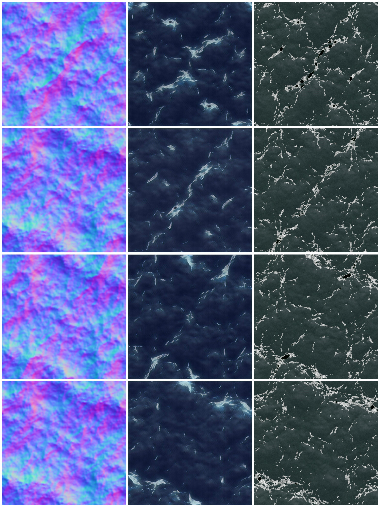
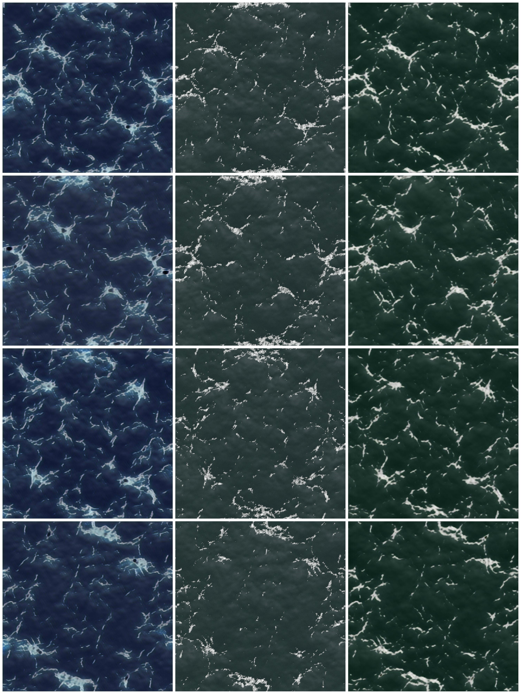

# OceaGAN
A GAN based texture generation model

###
This is a model based on [Ledig et al.](https://arxiv.org/abs/1609.04802) which generates ocean textures given the normal maps
of the ocean geometry.

---

[Project report](https://cdn.rawgit.com/arqcenick/OceaGAN/f9f80800/results/Cetin_YarkinDeniz_Polat_DorukYigit_CS565_Report.pdf)

Below you can see results from the model:

Normal Map \| Rendered \| Model Output | Without GAN \| With GAN \| With GAN
------------ |------------
 | 
